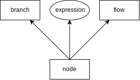
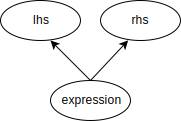
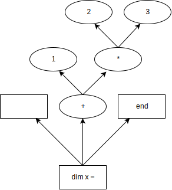

# Parse Tree

## Node
In the diagrams nodes are represented by rectangles. Each node can be connect too two other nodes one for the flow of the program and the other for any branching from that node.

_Node Layout_



## Expression
In the diagrams expressions are represented by ellipses. Each expression connects to two other expression but also stores a series of tokens genreally the operator being applied else it shall a the value to be used.

_Expression Layout_



## Trees

### Assignment example
```basic
dim x = 1 + (2 * 3)
```

